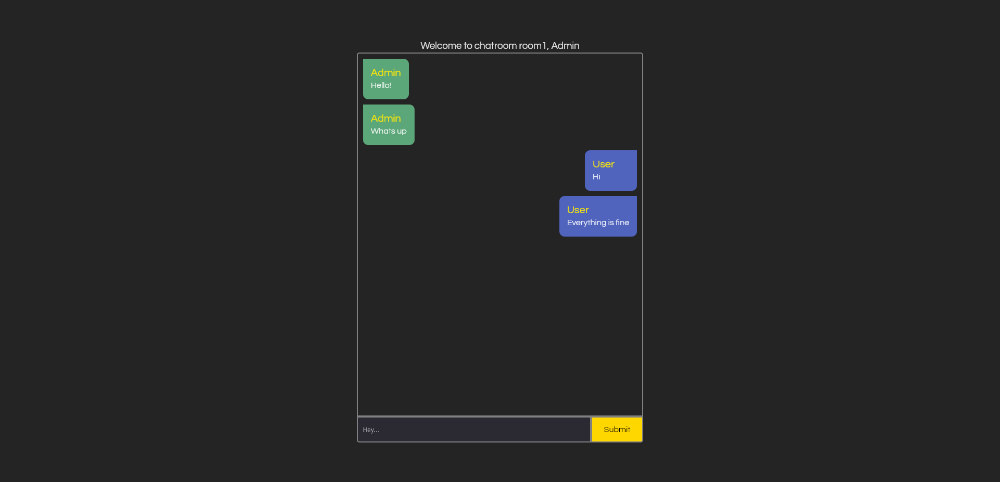

# Websocket Realtime Chat App

# Overview

Made by:

- **React**
- TypeScript
- Express.js
- Websocket.io
- Node.js

## Description

- Client side of this app made by React TypeScript, server side is made by Express.js with Websocket.io
- App provides realtime chat with same room.
- run `npm start` for server and run `npm run dev` for client to start app.

### Author

- LinkedIn - [Ömer Fatih Bülbül](https://www.linkedin.com/in/ömer-fatih-bülbül-74a890236/)
- Twitter - [fatihbulbul91](https://twitter.com/fatihbulbul91)
